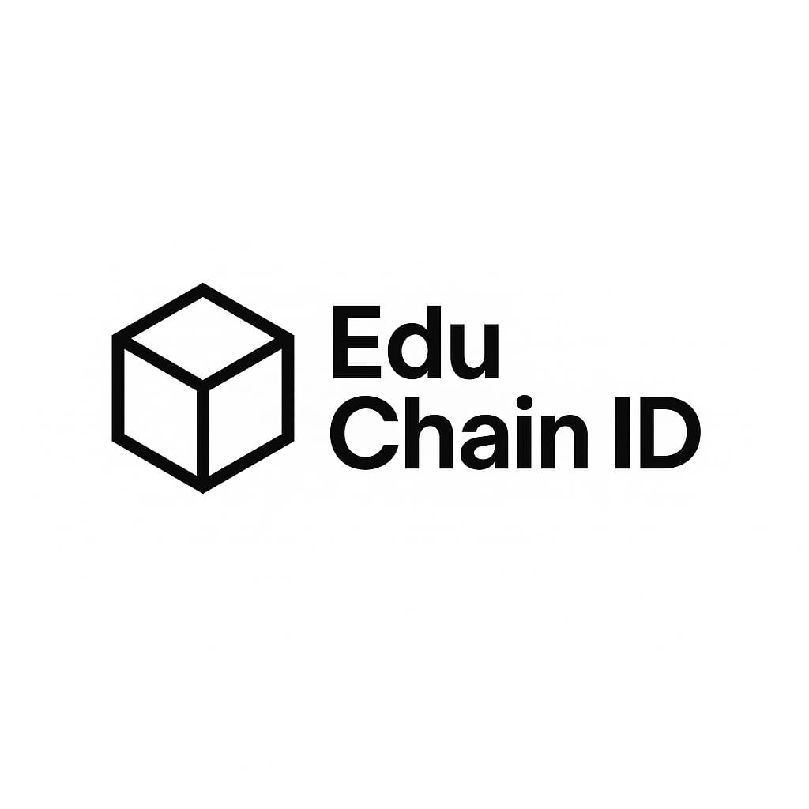

p align="center">
  

<h1 align="center">EduChain ID</h1>

<em>Bringing Web3 education to everyone — clear, inclusive, and empowering.</em>

---

## 🌟 About EduChain ID
EduChain ID is a decentralized education platform with a mission to make Web3 and future tech learning *accessible, practical, and human-friendly* — for everyone, not just the tech-savvy few.

---

## 🎯 Vision
To bridge the gap between innovation and public understanding by making education engaging, inclusive, and community-powered.  
We believe the future isn’t just about technology — it’s about people understanding and using it.

---

## 🧩 Key Features
- ✅ *Skill NFTs* — Verifiable on-chain proof of your skills  
- 🎮 *Gamified Learning* — Quests, rewards, and mentorship unlocks  
- 🧠 *Accessible Onboarding* — Even without a crypto wallet  
- 🌍 *Inclusive Design* — From non-tech users to advanced learners  
- 🫂 *Community-First* — Learn, support, and grow together  

---

## 🛠 Tech Stack
- *Layer 1:* Hedera Hashgraph  
- *Layer 2:* Optimism  
- *Others:* IPFS (planned), ENS (planned), Polygon PoS (optional)  

---

## 👤 Founder
Hi! I’m *Sakinah* — a solo builder passionate about education, Web3, and community empowerment.  

*Looking to collaborate with:*
- Developers  
- Designers  
- Writers & content creators  
- Fellow learners & educators  

---

## 📌 Why It Matters
Most people struggle to enter Web3 because it's too technical or confusing.  
EduChain ID flips the script — we make it *clear, **relevant, and **practical*.

Let’s build the future of education — together.
